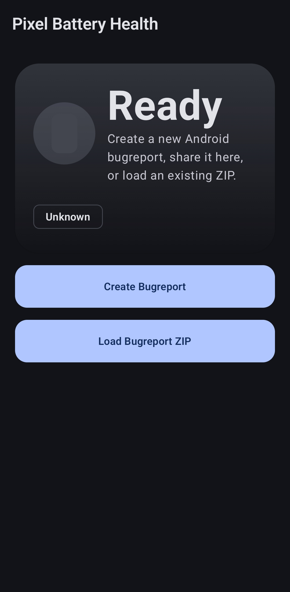
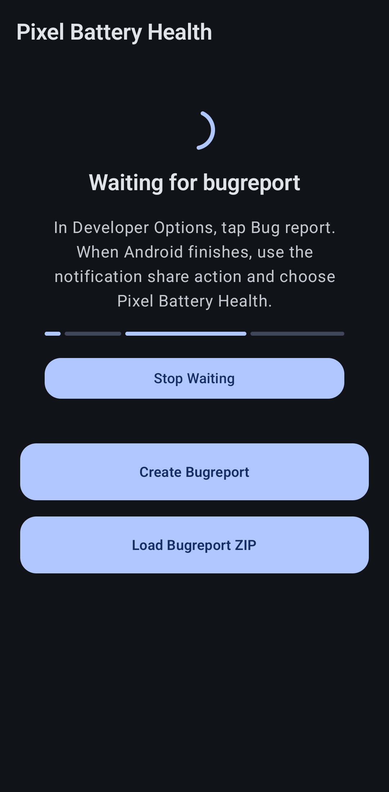

# Pixel Battery Health

Pixel Battery Health is an offline Android app for checking battery health from a Google Pixel bugreport.

It imports a Pixel bugreport ZIP, finds the correct report text automatically, extracts battery data, and shows a clean battery health summary.

  
  

## Features

- Import a Pixel bugreport ZIP from the Android file picker
- Receive bugreport ZIPs directly from the Android share sheet
- Guided flow for opening Developer Options and creating a new bugreport
- Automatic ZIP extraction and bugreport text detection
- Stage-by-stage import progress, cancellation, and timeout errors
- Battery health percentage calculated from estimated capacity and Pixel design capacity
- Estimated capacity, design capacity, cycle count, health status, temperature, and voltage
- Dark mode support
- Fully offline
- No internet permission

## Install

1. Open the [latest release](https://github.com/nuk3zz/pixel-battery-health/releases/latest).
2. Download the latest APK file.
3. Open the APK on your Pixel.
4. If Android asks, allow installation from that source.
5. Install **Pixel Battery Health**.

## How To Use

1. Open **Pixel Battery Health**.
2. Tap **Create Bugreport**.
3. In Developer Options, tap **Bug report**.
4. Wait for Android to finish generating the bugreport.
5. From the bugreport notification, choose the share action.
6. Select **Pixel Battery Health**.
7. The app imports and analyzes the ZIP automatically.

You can also use **Load Bugreport ZIP** if you already saved a bugreport file.

## Privacy

Pixel Battery Health works offline. It does not request internet access and does not upload your bugreport anywhere.

Bugreports can contain sensitive device logs. Only open bugreports you trust, and avoid sharing them publicly.

## Supported Pixel Models

The app includes Pixel design capacities and device codenames from the original Pixel through the current supported range. Pixel 9 is explicitly recognized as `Pixel 9` or `tokay` and uses Google's 4,700 mAh typical capacity. If the model cannot be detected, the app still shows parsed battery values but may not calculate a percentage.

The percentage uses the estimated real capacity reported by Android divided by the model's typical design capacity. Android's ASOC value is only used as a fallback when the capacity calculation is unavailable. Because measured capacity can exceed the manufacturer's typical rating, the displayed health percentage is capped at 100% while the measured mAh value remains visible.
